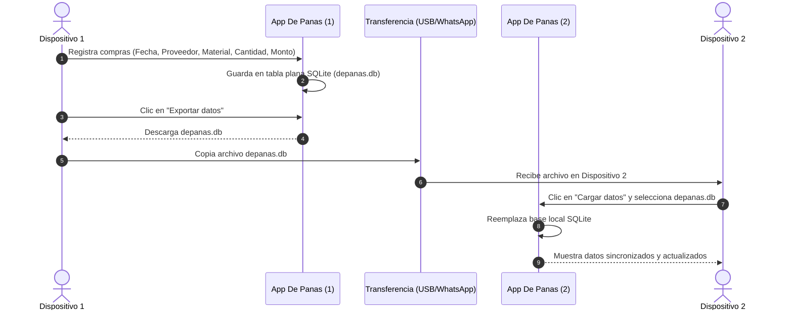

# Plan: Base de Datos SQLite + Frontend (De Panas SV)

> **Proyecto:** De Panas SV  
> **Alcance:** Creación de base de datos SQLite de una sola tabla, portabilidad entre dispositivos, renombre de Producto → Material, y validación de precio.

---

## 1. Resumen de Requerimientos

1. **Base de Datos SQLite (Una sola tabla):**
   * Crear una sola tabla en SQLite que contenga exactamente los 7 campos de la hoja de cálculo (`Tabla_DePanas.xlsx`):
     * `Fecha`
     * `Material` (anteriormente llamado *Producto*)
     * `Cantidad`
     * `Monto` (precio total ingresado en el formulario)
     * `Proveedor`
     * `Categoría` *(definida en la DB, por ahora con valor por defecto / pendiente de integración web)*
     * `Producto` *(destino final del insumo, definido en la DB, por ahora con valor por defecto / pendiente de integración web)*
2. **Registro desde "Agregar Compra":**
   * Cada compra registrada en la interfaz web inserta sus correspondientes filas en la tabla SQLite.
3. **Portabilidad entre Dispositivos:**
   * La base de datos (`depanas.db`) se puede **descargar (exportar)** desde la aplicación.
   * El archivo descargado puede enviarse a otro dispositivo (vía USB, WhatsApp, etc.).
   * En el segundo dispositivo, la aplicación permite **cargar (importar)** el archivo para actualizar y sincronizar la base de datos local.
4. **Renombrado global de "Producto" → "Material":**
   * Reemplazar el término "Producto" por "Material" en:
     * Código fuente interno (variables, estados, propiedades de objetos).
     * Interfaz gráfica (etiquetas, encabezados de columnas, textos de ayuda y placeholders).
5. **Validación de Precio:**
   * En el campo de precio/monto de "Agregar compra", el valor debe ser estrictamente `precio > 0.00` (mínimo visible `0.01`).
6. **Aclaración sobre "Categoría" y "Producto":**
   * Ambas columnas existen formalmente en el esquema de la base de datos SQLite para mantener compatibilidad con el histórico de Excel, pero **aún no se relacionan con campos en la interfaz web** (se registran como cadenas vacías o valores por defecto hasta su futura implementación).

---

## 2. FASE 1 — Estructura y Backend SQLite

### 2.1 Estructura del Backend

```text
DePanas/
  backend/
    db/
      schema.sql      <- Definición de la tabla plana SQLite
      depanas.db      <- Archivo de base de datos generado (.gitignored)
    routes/
      compras.js      <- Endpoints para registrar y consultar compras
      db_export.js    <- Endpoints para exportar e importar la base de datos
    index.js          <- Servidor Express (puerto 3000)
    package.json
```

### 2.2 Esquema de Base de Datos (`backend/db/schema.sql`)

Una única tabla plana, fiel a la estructura del Excel original:

```sql
CREATE TABLE IF NOT EXISTS ingresos (
    id         INTEGER PRIMARY KEY AUTOINCREMENT,
    fecha      TEXT NOT NULL,               -- Formato 'YYYY-MM-DD'
    material   TEXT NOT NULL,               -- Nombre del insumo o material comprado
    cantidad   REAL NOT NULL DEFAULT 1,     -- Cantidad numérica comprada
    monto      REAL NOT NULL,               -- Precio o importe total pagado por el material
    proveedor  TEXT NOT NULL,               -- Nombre del proveedor o comercio
    categoria  TEXT DEFAULT '',             -- En la DB (aún no vinculada a la web)
    producto   TEXT DEFAULT ''              -- En la DB (aún no vinculada a la web)
);
```

### 2.3 Endpoints del Servidor

* **CRUD de Compras (`/api/ingresos`):**
  * `GET /api/ingresos`: Consulta todas las compras (con filtros opcionales por proveedor, material y rango de fechas).
  * `POST /api/ingresos`: Inserta una compra con su lista de materiales en la tabla `ingresos`.
* **Portabilidad y Sincronización (`/api/db`):**
  * `GET /api/db/exportar`: Descarga directamente el archivo binario `depanas.db`.
  * `POST /api/db/importar`: Recibe un archivo `.db`, reemplaza el archivo local y reinicializa la conexión SQLite de forma transparente.
  * `GET /api/db/exportar-json` y `POST /api/db/importar-json`: Métodos alternativos en formato JSON para transferencias ligeras.

---

## 3. FASE 2 — Cambios en el Frontend

### 3.1 Renombrado de "Producto" a "Material"

| Archivo | Cambio Interno (Código) | Cambio Visible en Pantalla (UI) |
| :--- | :--- | :--- |
| `frontend/src/services/api.js` | `productos[]` → `materiales[]`; `p.producto` → `m.material`; `p.precio` → `m.monto`; `getProductos()` → `getMateriales()` | — |
| `frontend/src/components/BloqueCompra.jsx` | `fila.producto` → `fila.material`; `fila.precio` → `fila.monto` | Encabezado `"Material"`, label `"Material"`, placeholder `"Ej: Harina de maíz"` |
| `frontend/src/components/BloqueCompra.module.css` | `.colProducto` → `.colMaterial` | Estilos de ancho de columna ajustados |
| `frontend/src/components/DetalleLista.jsx` | Mapeo de `materiales[]` | Encabezado de tabla `"Material"` |
| `frontend/src/components/FiltrosEnLinea.jsx` | `filtros.producto` → `filtros.material` | Etiqueta del filtro `"Material"` |
| `frontend/src/pages/PantallaMaestra.jsx` | Lectura de `lista.materiales` | Columna `"Materiales"` y textos en aria-label |
| `frontend/src/pages/AgregarCompra.jsx` | Mensajes toast adaptados a `material(es)` | Notificaciones de compra guardada |

### 3.2 Validación de Precio (`precio > 0.00`)

* En el componente de entrada de precio en `BloqueCompra.jsx`:
  * Configurar `min="0.01"` y `placeholder="0.00"`.
  * Mantener la validación en `validarFila` impidiendo guardar si el valor es menor o igual a cero.

### 3.3 Portabilidad en la Interfaz (Exportar / Cargar Base de Datos)

En la vista de compras (`AgregarCompra.jsx`):
* **Botón "Exportar datos":** Descarga el archivo de base de datos actual para poder transferirlo.
* **Botón "Cargar datos":** Abre un selector de archivo (`.db`, `.sqlite`, `.json`) que envía la base de datos al backend para sustituir los datos locales.

---

## 4. Flujo de Trabajo entre Dos Dispositivos



---

## 5. Resumen del Plan de Implementación

1. **Base de Datos SQLite:**
   * Configurar SQLite con tabla única `ingresos` que contenga: `fecha`, `material`, `cantidad`, `monto`, `proveedor`, `categoria` y `producto`.
2. **Servicio y Endpoints:**
   * Crear endpoints REST para guardar ingresos y descargar/cargar el archivo de base de datos.
3. **Frontend:**
   * Cambiar todas las apariciones de "Producto" por "Material" en vistas y componentes.
   * Asegurar restricción `precio > 0.00` (`min="0.01"`).
   * Mantener los campos `categoria` y `producto` en la base de datos con valores vacíos por defecto, sin renderizarlos en la interfaz gráfica por ahora.
   * Conectar los botones de exportar y cargar base de datos en la UI.
