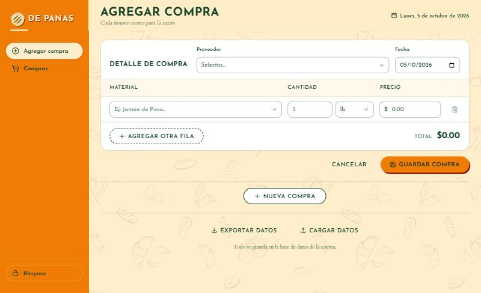
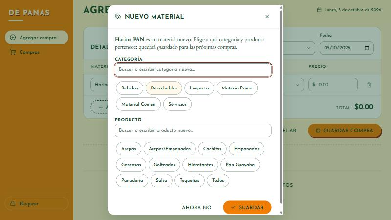
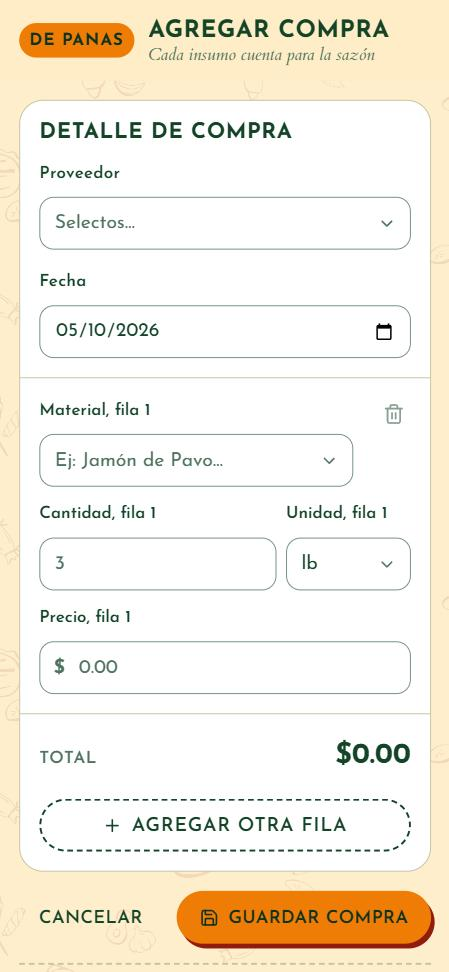
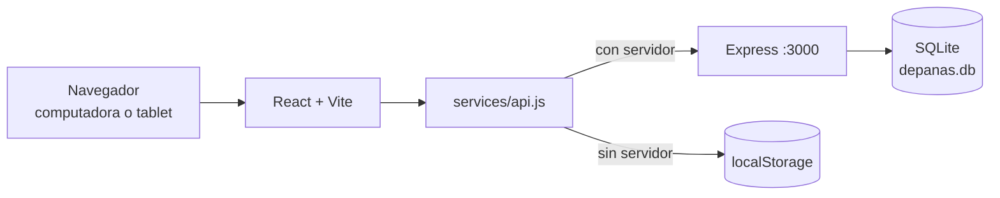

# De Panas — Registro de compras y costos

Aplicación web local para que **De Panas**, un negocio de comida venezolana, registre sus compras de insumos con proveedor, fecha y costo, y sepa cuánto gasta. Proyecto de Programación Orientada a Objetos del equipo **FORGE** (Instituto Kriete), con un cliente real.

## El problema y el cliente

- De Panas tiene local propio. Marta Martínez es la dueña principal y prepara la comida; César, socio, lleva la administración y es nuestro contacto.
- Su sistema de ventas solo tiene cargados los productos. **No hay un registro de compras de insumos**: qué se compró, a quién, cuánto y a qué precio.
- Restricciones: sin presupuesto para hosting ni dominio, todo en dólares y funcionando en la red local (computadora + tablet), sin internet.
- Lo levantamos conversando con César y lo validamos con él en una llamada el 25/09/2026. Detalle en [Documento de descubrimiento](Documento%20de%20descubrimiento%20-%20De%20Panas.pdf) y [Documento de requerimientos](Documento%20de%20requerimientos%20-%20De%20Panas.pdf).
- El negocio ya llevaba sus compras en un Excel (`Datos De Panas.xlsx`). Sus listas de proveedores, categorías, materiales y productos son el catálogo inicial de la app.

## Funcionalidades

**Implementado:**

- **Pantalla de acceso** con contraseña (teclado numérico para la tablet). La sesión dura hasta cerrar la pestaña y el menú tiene un botón **Bloquear**.
- **Registro de compras** (página principal). Proveedor y fecha se escriben una vez; cada fila lleva material, cantidad, unidad y precio. El total se calcula en vivo.
- **Varias compras a la vez.** "Nueva compra" agrega otro bloque, y cada uno tiene su propio Guardar.
- **Buscador tipo Excel** en Proveedor y Material: un clic muestra todas las opciones, al escribir se filtran (sin distinguir tildes ni mayúsculas) y también se puede escribir un valor nuevo.
- **Catálogo del Excel:** 4 proveedores, 6 categorías, 36 materiales y 12 productos, sembrados en la base de datos.
- **Categoría y producto de cada material**, como en el Excel (por ejemplo, Tocino La Rioja → Materia Prima · Cachitos). Si un material es nuevo o le falta alguno, una ventana pide elegirlos con botones; si lo escrito no existe, se agrega como categoría o producto nuevo.
- **Validación al guardar**, con el error junto a cada campo y un resumen con enlaces. Las filas vacías se ignoran.
- **Listas de compra**: tabla con proveedor, cantidad de materiales, gasto total y fecha.
- **Detalle de cada compra** para ver, editar o eliminar (con confirmación).
- **Filtros en línea** por proveedor, material y rango de fechas.
- **Configuración** (menú, arriba de Bloquear): cuatro opciones para administrar proveedores, categorías, materiales y productos. Se pueden agregar, cambiar de nombre y eliminar; cambiar un nombre lo actualiza también en las compras guardadas. En cada material se ven y se cambian su categoría y su producto, y al agregarlo se pueden crear categorías o productos nuevos.
- **Base de datos SQLite** (backend Node.js + Express). Sin servidor, la app funciona igual guardando en el navegador (modo local); los dos modos nunca se mezclan.
- **Exportar datos** (pantalla propia): eliges un rango de fechas (o este mes, mes pasado, este año, todo) y el formato, Excel (`.csv`) o respaldo (`.json`), y ves cuántas compras y cuánto dinero entran antes de descargar.
- **Cargar datos** (pantalla propia): por ahora muestra "Estamos trabajando en ello". La API ya acepta un `.db` (reemplaza la base con respaldo) o un `.json` (agrega sin duplicar).
- **Interfaz con la marca De Panas**: collage de las ilustraciones del brandbook sobre el fondo crema, la arepa del logo en el menú, mensajes con la voz de marca ("¡Listo, pana!", "Hoy toca arepita…"), adaptable a escritorio y móvil, con contraste WCAG AA.

**Pendiente** (según el documento de requerimientos):

- Pantalla de Cargar datos (la API ya existe).
- Conversión automática de unidades (HU-02).
- Reportes de gastos por producto y por periodo (HU-03).
- Acceso desde la tablet por la red local.

## Capturas de pantalla

| Registro de compras | Material nuevo: categoría y producto |
|---|---|
|  |  |

| Acceso (móvil) | Registro (móvil) | Compras (móvil) |
|---|---|---|
|  |  |  |

## Tecnologías

| Parte | Tecnología |
|---|---|
| Frontend | React 18.3, Vite 5.4, React Router 6.26, Motion 14, lucide-react 0.441 |
| Estilos | CSS Modules y tokens de diseño propios |
| Backend | Node.js ≥ 22.13, Express 4.19, `node:sqlite`, multer |
| Calidad | Vitest 2 + Testing Library, ESLint 9 con `jsx-a11y`; `node --test` en el backend |
| Fuentes | Josefin Sans y Cardo (Google Fonts) |

**POO:** el código actual no define clases. El frontend usa componentes funcionales de React (`frontend/src/components/`) y el backend usa funciones de Express (`backend/routes/`). [COMPLETAR: principios de POO aplicados o previstos (clases, herencia, encapsulamiento) y en qué archivos]

## Arquitectura

```
frontend/src/
  pages/          AgregarCompra (principal), PantallaMaestra (compras), PantallaConfiguracion,
                  PantallaExportar, PantallaCargar y PantallaContrasena (acceso)
  components/     BloqueCompra, AsignarMaterial, EditorCatalogo, DetalleLista, FiltrosEnLinea, navegación…
  components/common/  Piezas base: Boton, Campo, Modal, Tarjeta…
  context/        Toasts y sesión (AuthContext)
  services/api.js Única capa de datos (modo servidor o local)
  utils/          Formato, exportar.js (CSV/JSON) y mensajes.js (todos los textos del sistema)
  styles/         Tokens de marca, collage de fondo y presets de movimiento
frontend/public/brand/  Logo, arepa, íconos y el collage de la pág. 10 del brandbook
backend/
  routes/         compras.js (/api/ingresos), listas.js (/api/compras), catalogo.js, db_export.js
  db/             schema.sql y catalogo.js (catálogo inicial del Excel)
  db.js           Apertura, migraciones y siembra del catálogo
docs/             Decisiones técnicas, planes y capturas
```

Cada carpeta de `frontend/src/` tiene su propio `README.md`.



### API del backend

| Ruta | Qué hace |
|---|---|
| `GET /api/health` | El frontend lo usa para decidir si trabaja con el servidor |
| `GET/POST /api/compras`, `GET/PUT/DELETE /api/compras/:id` | Compras completas (proveedor, fecha y materiales), agrupadas por `compra_id`. Valida montos y cantidades > 0 |
| `GET /api/compras/sugerencias` | Nombres para el autocompletado |
| `GET /api/catalogo` | Proveedores, categorías, productos y materiales con su categoría y producto, y `uso` (compras o materiales que usan cada opción) |
| `PUT /api/catalogo/materiales/:nombre` | Asigna categoría y producto a un material (crea los que no existan) |
| `POST /api/catalogo/:tipo` | Agrega un proveedor, categoría, material (con su categoría y producto) o producto |
| `PUT /api/catalogo/:tipo/:nombre` | Cambia el nombre (y, en un material, su categoría y producto) y lo actualiza en todas las compras |
| `DELETE /api/catalogo/:tipo/:nombre` | Quita la opción; las compras conservan su texto |
| `/api/ingresos` | Acceso fila por fila a la tabla |
| `GET /api/db/exportar`, `POST /api/db/importar` | Copia completa de `depanas.db` (`VACUUM INTO`) y reemplazo con validación y respaldo |
| `GET /api/db/exportar-json`, `POST /api/db/importar-json` | Compras en JSON; importar fusiona sin duplicar |

## Cómo ejecutarlo

Requisitos: Node.js y npm. El backend necesita Node.js ≥ 22.13 por `node:sqlite` (probado con v24.16.0).

**Backend** (desde `backend/`):

```bash
npm install
npm start          # http://localhost:3000 (o npm run dev, con recarga)
npm test
```

La base se crea sola en `backend/db/depanas.db` (ignorada por git) con el catálogo del Excel.

**Frontend** (desde `frontend/`):

```bash
npm install
npm run dev        # http://localhost:5173 (redirige /api al backend)
npm run test:run   # tests
npm run lint
npm run build      # producción en frontend/dist/
```

Sin el backend encendido, el frontend trabaja en modo local con datos de ejemplo. La contraseña de acceso de prueba es `1234` (`frontend/src/context/AuthContext.jsx`).

Los comandos se probaron en Windows 11.

## Decisiones de diseño

La identidad visual sale del **Brandbook DE PANAS (mayo 2026)**. Lo esencial:

- **Colores:** Naranja Sazón `#EF7D05` y Crema y Trigo `#FEEECC` son los protagonistas. El texto va en Verde Ávila `#144428`.
- **Tipografía:** Josefin Sans para títulos e interfaz; Cardo para textos largos y las frases de marca.
- **Elementos gráficos:** las ilustraciones de la pág. 10 forman un collage al 10 % de opacidad sobre el fondo crema. En el menú, la arepa del logo acompaña al nombre.
- **Voz de marca** (diapositiva 10): cercana, venezolana y vibrante en confirmaciones y encabezados; clara y sin modismos en errores.
- **Accesibilidad:** contraste WCAG AA verificado, también sobre los trazos del collage. El texto sobre naranja usa un tono más oscuro del verde (`#0F331E`).
- **Movimiento:** respuesta inmediata al presionar, animaciones interrumpibles y respeto por "reducir movimiento".
- **Datos:** tablas sobrias, con montos alineados a la derecha.

Más detalle en [DESIGN_DECISIONS.md](DESIGN_DECISIONS.md) y [docs/DECISIONS.md](docs/DECISIONS.md).

## Flujo de trabajo del equipo

- Una rama por cambio (por ejemplo `refactor/frontend-marca`, `fix/db-bloqueantes`) y Pull Request hacia `main`.
- Commits con prefijo y área: `feat(compras): …`, `fix(agregar-compra): …`, `refactor(estilos): …`, `chore: …`, `docs: …`, `test: …`.
- Antes de abrir un PR: `npm run lint`, `npm run test:run` y `npm run build` en `frontend/`, y `npm test` en `backend/`.
- Comandos básicos de Git: [PASOS_GIT.md](PASOS_GIT.md).

## Equipo FORGE

| Integrante | GitHub | Rol |
|---|---|---|
| Gabriel Valencia | [@Gabrielvalen08](https://github.com/Gabrielvalen08) | [COMPLETAR: rol] |
| Soham Villacorta | [@casoham](https://github.com/casoham) | [COMPLETAR: rol] |
| Alejandro Salgado | [@alsalgado-24](https://github.com/alsalgado-24) | [COMPLETAR: rol] |

## Estado y próximos pasos

**Estado:** registro y consulta de compras con base de datos SQLite, catálogo del Excel editable desde Configuración, exportación por rango y pantalla de acceso, con 105 tests en el frontend y 24 en el backend.

**Próximos pasos:**

1. Pantalla de Cargar datos.
2. Conversión de unidades y reportes de gastos por producto y periodo.
3. Acceso desde la tablet por la red local.
4. Prueba en la computadora y la tablet del negocio, y validación con César y Marta.
