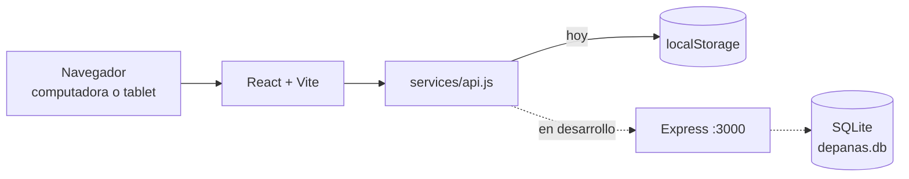

# De Panas — Registro de compras y costos

Aplicación web local para que **De Panas**, un negocio de comida venezolana, registre sus compras de insumos con proveedor, fecha y costo, y sepa cuánto gasta. Proyecto de Programación Orientada a Objetos del equipo **FORGE** (Instituto Kriete), con un cliente real.

## El problema y el cliente

- De Panas tiene local propio. Marta Martínez es la dueña principal y prepara la comida; César, socio, lleva la administración y es nuestro contacto.
- Su sistema de ventas solo tiene cargados los productos. **No hay un registro de compras de insumos**: qué se compró, a quién, cuánto y a qué precio.
- Restricciones: sin presupuesto para hosting ni dominio, todo en dólares y funcionando en la red local (computadora + tablet), sin internet.
- Lo levantamos conversando con César y lo validamos con él en una llamada el 25/09/2026. Detalle en [Documento de descubrimiento](Documento%20de%20descubrimiento%20-%20De%20Panas.pdf) y [Documento de requerimientos](Documento%20de%20requerimientos%20-%20De%20Panas.pdf).

## Funcionalidades

**Implementado** (rama `main`):

- **Registro de compras** (página principal). Proveedor y fecha se escriben una vez; cada fila lleva producto, cantidad, unidad y precio. El total se calcula en vivo.
- **Varias compras a la vez.** "Nueva compra" agrega otro bloque, y cada uno tiene su propio Guardar.
- **Validación al guardar**, con el error junto a cada campo y un resumen con enlaces. Las filas vacías se ignoran.
- **Autocompletado** de proveedores y productos ya usados.
- **Listas de compra**: tabla con proveedor, cantidad de productos, gasto total y fecha.
- **Detalle de cada compra** para ver, editar o eliminar (con confirmación).
- **Filtros en línea** por proveedor, producto y rango de fechas.
- **Interfaz con la marca De Panas**, adaptable a escritorio y móvil, con contraste WCAG AA.

> Hoy los datos se guardan **en el navegador** (`localStorage`), con datos de ejemplo.

**En desarrollo** (PR #2 y #3, aún sin fusionar):

- Backend Node.js + Express con base de datos SQLite.
- Exportar e importar la base para pasar los datos de un equipo a otro sin internet.
- Renombre de "Producto" a "Material" en la interfaz.

**Pendiente** (según el documento de requerimientos):

- Maestros de proveedores, insumos y productos terminados (HU-01).
- Conversión automática de unidades (HU-02).
- Reportes de gastos por producto y por periodo (HU-03).
- Acceso desde la tablet por la red local.

## Capturas de pantalla


## Tecnologías

| Parte | Tecnología |
|---|---|
| Frontend | React 18.3, Vite 5.4, React Router 6.26, Motion 14, lucide-react 0.441 |
| Estilos | CSS Modules y tokens de diseño propios |
| Calidad | Vitest 2 + Testing Library, ESLint 9 con `jsx-a11y` |
| Backend (en desarrollo) | Node.js ≥ 22.13, Express 4.19, `node:sqlite`, multer |
| Fuentes | Josefin Sans y Cardo (Google Fonts) |

**POO:** el código actual no define clases. El frontend usa componentes funcionales de React (`frontend/src/components/`) y el backend en desarrollo usa funciones de Express (`backend/routes/`). [COMPLETAR: principios de POO aplicados o previstos (clases, herencia, encapsulamiento) y en qué archivos]

## Arquitectura

```
frontend/src/
  pages/          Pantallas: AgregarCompra (principal) y PantallaMaestra (compras)
  components/     BloqueCompra, DetalleLista, FiltrosEnLinea, navegación…
  components/common/  Piezas base: Boton, Campo, Modal, Tarjeta…
  services/api.js Única capa de datos
  styles/         Tokens de marca y presets de movimiento
docs/             Decisiones técnicas y planes
```

Cada carpeta de `src/` tiene su propio `README.md`.



## Cómo ejecutarlo

Requisitos: Node.js y npm. El backend necesita Node.js ≥ 22.13 por `node:sqlite` (probado con v24.16.0).

**Frontend** (desde `frontend/`):

```bash
npm install
npm run dev        # http://localhost:5173
npm run test:run   # tests
npm run lint
npm run build      # producción en frontend/dist/
```

**Backend** (en desarrollo; disponible en la rama `fix/db-bloqueantes`, desde `backend/`):

```bash
npm install
npm start          # http://localhost:3000 (el frontend redirige /api ahí)
npm test
```

Los comandos de esta sección se probaron en Windows 11: los del frontend en `main` y los del backend en `fix/db-bloqueantes`.

## Decisiones de diseño

La identidad visual sale del **Brandbook DE PANAS (mayo 2026)**. Lo esencial:

- **Colores:** Naranja Sazón `#EF7D05` y Crema y Trigo `#FEEECC` son los protagonistas. El texto va en Verde Ávila `#144428`.
- **Tipografía:** Josefin Sans para títulos e interfaz; Cardo para textos largos.
- **Accesibilidad:** contraste WCAG AA verificado. El texto sobre naranja usa un tono más oscuro del verde (`#0F331E`).
- **Movimiento:** respuesta inmediata al presionar, animaciones interrumpibles y respeto por "reducir movimiento".
- **Datos:** tablas sobrias, con montos alineados a la derecha.

Más detalle en [DESIGN_DECISIONS.md](DESIGN_DECISIONS.md) y [docs/DECISIONS.md](docs/DECISIONS.md).

## Flujo de trabajo del equipo

- Una rama por cambio (por ejemplo `refactor/frontend-marca`, `fix/db-bloqueantes`) y Pull Request hacia `main`.
- Commits con prefijo y área: `feat(compras): …`, `fix(agregar-compra): …`, `refactor(estilos): …`, `chore: …`, `docs: …`, `test: …`.
- Antes de abrir un PR: `npm run lint`, `npm run test:run` y `npm run build` en `frontend/`.
- Comandos básicos de Git: [PASOS_GIT.md](PASOS_GIT.md).

## Equipo FORGE

| Integrante | GitHub | Rol |
|---|---|---|
| Gabriel Valencia | [@Gabrielvalen08](https://github.com/Gabrielvalen08) | [COMPLETAR: rol] |
| Soham Villacorta | [@casoham](https://github.com/casoham) | [COMPLETAR: rol] |
| Alejandro Salgado | [@alsalgado-24](https://github.com/alsalgado-24) | [COMPLETAR: rol] |

## Estado y próximos pasos

**Estado:** el frontend de registro y consulta de compras está completo y probado (41 tests). El backend con SQLite está en revisión (PR #2 y su corrección en el #3).

**Próximos pasos:**

1. Fusionar el backend y conectar el frontend a SQLite.
2. Maestros de proveedores, insumos y productos terminados.
3. Conversión de unidades y reportes de gastos.
4. Prueba en la computadora y la tablet del negocio, y validación con César y Marta.
